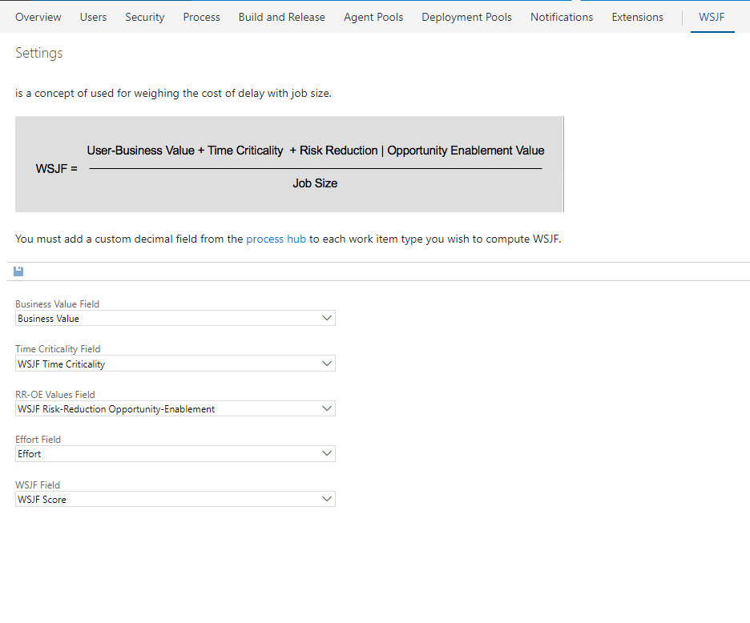

Update the Result field value based on 
Priority and Risk field value

Two values are used decide the result:
* **Priority**
* **Risk**

# Setup
1. The first thing you need is to create the fields that will store the Result values.  [Create a custom string field](https://www.visualstudio.com/en-us/docs/work/process/customize-process-field#add-a-custom-field) through the process hub and add it to the work items you want to display WSJF data on.


*NOTE: If you're using TFS onprem, you need to use witadmin to [Create a custom decimal field](https://www.visualstudio.com/en-us/docs/work/customize/add-modify-field#to-add-a-custom-field)*

2. Navigate to the "Decide field value" hub on the collection settings admin experience. 
 From here, you must specify the fields that will be used for Priority, Risk and to store the Result. The first two are defaulted to the fields provided out of the box by Microsoft but can be changed to custom fields if you prefer.

## Settings hub
* Specify which fields are used for Result, Priority, Risk.

## Support
Because this extension requires the new work item form, it is only supported on Azure DevOps and the next version of TFS 2018 and above.
 
 ### Adding RROE and WSJF Score Values (For TFS) ###
 
 1. Export your WorkItem.XML file *(ie. Epic.XML)* using [WITAdmin](https://docs.microsoft.com/en-us/Azure DevOps/work/customize/reference/witadmin/witadmin-import-export-manage-wits?view=tfs-2018)
 2. At the bottom of your "Fields" section add the following (Name and reference names may vary):
 
``` xml
  <FIELD name="WSJF Risk-Reduction Opportunity-Enablement" refname="WSJF.RROEValue" type="Integer" reportable="dimension">
   <HELPTEXT>WSJF Risk-Reduction</HELPTEXT>
 </FIELD>
 
 <FIELD name="WSJF Score" refname="WSJF.Score" type="Double" reportable="dimension">
   <HELPTEXT>WSJF Score</HELPTEXT>
 </FIELD> 
```
3. Under your 
`<Form>` and `<WebLayout>` tags, choose where you would like the WSJF calculation to go and add:

```xml
<Section>
		   <Group Label="WSJF">
              <Control Label="User-Business Value" Type="FieldControl" FieldName="Microsoft.Azure DevOps.Common.BusinessValue" EmptyText="[Numbered Value]" />
              <Control Label="Urgency/Time Criticality" Type="FieldControl" FieldName="Microsoft.Azure DevOps.Common.TimeCriticality" EmptyText="[Numbered Value]" />
              <Control Label="Risk Reduction/Opportunity Enablement" Type="FieldControl" FieldName="WSJF.RROEValue" EmptyText="[Numbered Value]" />
			           <Control Label="Size" Type="FieldControl" FieldName="Microsoft.Azure DevOps.Scheduling.Effort" EmptyText="[Numbered Value]" />
              <Control Label="WSJF Score" Type="FieldControl" FieldName="WSJF.Value" EmptyText="[Numbered Value]" />
     </Group>
</Section>
```
4. After this is done, open up your WSJF tab and adjust your settings:

